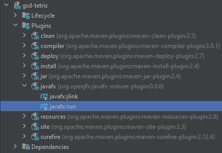
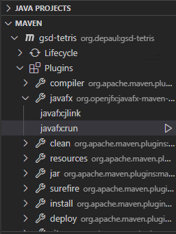
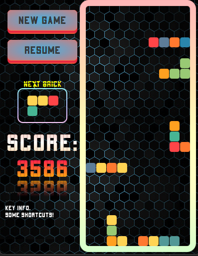

[//]: # (![]&#40;https://img.shields.io/badge/course-Global%20Software%20Dev-blue?logo=windowsterminal&#41; )

[//]: # (![]&#40;https://img.shields.io/badge/Version-4.23.0.0-orange?logo=verizon&#41;)

[//]: # (![https://www.apache.org/licenses/LICENSE-2.0.html]&#40;https://img.shields.io/badge/License-Apache--2.0-8A2BE2?logo=apache&#41;)

[//]: # ()
[//]: # (![https://openjdk.org/projects/jdk/21/]&#40;https://img.shields.io/badge/Oracle%20OpenJDK-21-cyan?logo=openjdk&#41;)

[//]: # (![https://maven.apache.org/download.cgi]&#40;https://img.shields.io/badge/Apache%20Maven-3.9.5-red?logo=apachemaven&#41;)
<p align="center">
    <a href="https://depaul.v-alizadeh.info/se475">
        
    </a>
    <a href="">
        
    </a>
    <a href="https://www.apache.org/licenses/LICENSE-2.0.html">
        
    </a>
</p>
<p align="center">
    <a href="https://openjdk.org/projects/jdk/21/">
        
    </a>
    <a href="https://maven.apache.org/download.cgi">
        
    </a>
</p>

<hr/>


<hr/>

# Tetris Game 

<hr/> 

## Execution

### Using IDE
You can use Maven plugin and the mvn goal from your IDE (Intellij and VS code). Also, you can directly run <a href="src/main/java/org/depaul/app/Main.java" style="color: blue; text-decoration: underline;text-decoration-style: dotted;">Main Method</a>.

<!-- [**Main Method**](src/main/java/org/depaul/app/Main.java) -->

#### Intellij



#### VS Code



### Using Maven

Alternatively, you can run the game by executing the following command in terminal. Make sure you are in the root directory of Tetris application.

`mvn clean javafx:run
`

<hr/> 

## Screenshots


<hr/> 

## ```OpenJFX``` Documentation: Run HelloWorld using Maven

[https://openjfx.io/openjfx-docs/#maven](https://openjfx.io/openjfx-docs/#maven)
